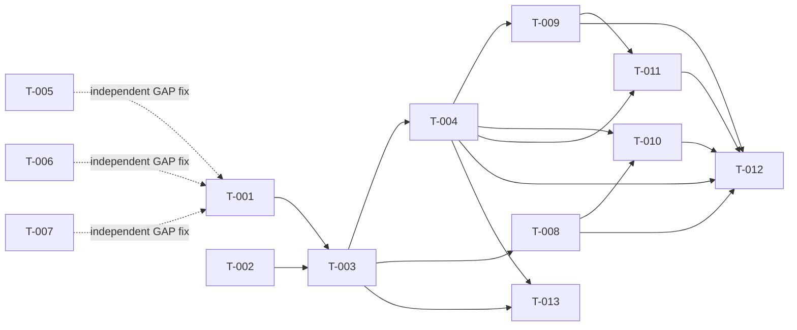

# Build Site: SOAP Protocol & Runtime

13 requirements across 3 tiers from **cavekit-protocol.md**.

---

## Tier 0 — No Dependencies (Start Here)

| Task | Title | Cavekit | Requirement | Effort |
|------|-------|---------|-------------|--------|
| T-001 | Implement SOAP 1.1 envelope construction (R1 functional requirements) | protocol | R1 | M |
| T-002 | Verify and document client certificate endpoint configuration | protocol | R8 | S |

---

## Tier 1 — Depends on Tier 0

| Task | Title | Cavekit | Requirement | blockedBy | Effort |
|------|-------|---------|-------------|-----------|--------|
| T-003 | Implement HTTP POST request execution with serialized envelope | protocol | R2 | T-001 | M |
| T-004 | Implement SOAP response envelope parsing (R3 functional requirements) | protocol | R3 | T-003 | M |
| T-005 | Fix: Enable server certificate validation in Protocol.fs [GAP-R9] | protocol | R9 | none | S |
| T-006 | Fix: Add HTTP timeout configuration and enforcement [GAP-R10] | protocol | R10 | none | S |
| T-007 | Fix: Implement resource cleanup (WebResponse, streams) [GAP-R11] | protocol | R11 | none | M |
| T-008 | Fix: Stream-based response body handling [GAP-R12] | protocol | R12 | T-004 | M |

---

## Tier 2 — Depends on Tier 1

| Task | Title | Cavekit | Requirement | blockedBy | Effort |
|------|-------|---------|-------------|-----------|--------|
| T-009 | Implement SOAP Fault detection and exception raising (R4) | protocol | R4 | T-004 | M |
| T-010 | Implement multipart SOAP response handling (R5) | protocol | R5 | T-004, T-008 | M |
| T-011 | Implement ResponseReady event signaling (R6) | protocol | R6 | T-004, T-009 | M |
| T-012 | Implement response deserialization (R7) | protocol | R7 | T-009, T-010 | M |
| T-013 | Implement request/response logging infrastructure [GAP-R13, Optional] | protocol | R13 | T-003, T-004 | M |

---

## Summary

| Tier | Tasks | Effort |
|------|-------|--------|
| 0 | 2 | 1M + 1S |
| 1 | 6 | 4M + 2S |
| 2 | 5 | 5M |

**Total: 13 tasks, 3 tiers** (original build; remediation tasks T-014..T-017 in Tier 3 below)

---

## Tier 3 — Remediation (ck:check findings)

| Task | Title | Cavekit | Requirement | blockedBy | Finding | Effort |
|------|-------|---------|-------------|-----------|---------|--------|
| T-014 | Fix parseSoapEnvelopeBody stream ownership — XmlReaderSettings{CloseInput=false} | protocol | R11 | T-007 | F-001 (P1) | S |
| T-015 | Fix fault handling — InnerXml→Value; fallback at line 74 raises XRoadFault | protocol | R4 | T-009 | F-002/F-003/F-009 (P2) | S |
| T-016 | Fix integration test port allocation TOCTOU race; silence → exception propagation | protocol | R7 | T-012 | F-004/F-005 (P2) | S |
| T-017 | Formalize R14 RequestReady event — verify criteria, add R6.e test (fault path fires ResponseReady) | protocol | R14/R6 | T-011 | over-built/F-007 (P3) | S |
| T-018 | Remediate 2nd-check findings: CloseInput=false in checkFaultInStream; expose serverError in startSoapServer; add `new` to TcpListener calls | protocol | R11/R4 | T-017 | F-PF-009/F-PF-010/F-PF-011 (P2/P3) | S |

---

## Coverage Matrix

| Cavekit | Req | Criterion | Task(s) | Status |
|---------|-----|-----------|---------|--------|
| protocol | R1 | Envelope uses SOAP 1.1 namespace (http://schemas.xmlsoap.org/soap/envelope/) | T-001 | COVERED |
| protocol | R1 | Envelope wraps Header and Body elements | T-001 | COVERED |
| protocol | R1 | Header contains protocolVersion element (set to "4.0") | T-001 | COVERED |
| protocol | R1 | Header contains unique id element (UUID per request) | T-001 | COVERED |
| protocol | R1 | Header contains service element with full identifier | T-001 | COVERED |
| protocol | R1 | Header contains client element with client identifier | T-001 | COVERED |
| protocol | R1 | Namespace declarations for X-Road (xro, iden prefixes) | T-001 | COVERED |
| protocol | R1 | Body element contains operation-specific request content | T-001 | COVERED |
| protocol | R1 | Envelope uses UTF-8 encoding | T-001 | COVERED |
| protocol | R1 | Subsystem codes are optional (omitted if empty) | T-001 | COVERED |
| protocol | R1 | Service versions are optional (omitted if empty) | T-001 | COVERED |
| protocol | R2 | HTTP POST request method is used | T-003 | COVERED |
| protocol | R2 | Content-Type header is set to "text/xml; charset=utf-8" | T-003 | COVERED |
| protocol | R2 | SOAPAction header is set to empty string | T-003 | COVERED |
| protocol | R2 | Request body is the serialized SOAP envelope | T-003 | COVERED |
| protocol | R2 | Request URI is the X-Road security server endpoint | T-003 | COVERED |
| protocol | R2 | Client certificates are attached if configured | T-003, T-002 | COVERED |
| protocol | R2 | Request is sent synchronously | T-003 | COVERED |
| protocol | R2 | HTTP response is received and read into memory stream | T-003 | COVERED |
| protocol | R3 | Response XML is parsed into XmlReader | T-004 | COVERED |
| protocol | R3 | Envelope element is located in SOAP namespace | T-004 | COVERED |
| protocol | R3 | Body element is located within Envelope | T-004 | COVERED |
| protocol | R3 | Body content element is first child of Body | T-004 | COVERED |
| protocol | R3 | Content is extracted for deserialization | T-004 | COVERED |
| protocol | R3 | Missing Envelope or Body fails with clear error | T-004 | COVERED |
| protocol | R4 | Fault element in Body is detected (XPath expression matches) | T-009 | COVERED |
| protocol | R4 | faultCode element is extracted | T-009 | COVERED |
| protocol | R4 | faultstring element is extracted | T-009 | COVERED |
| protocol | R4 | Exception is raised with fault code and message | T-009 | COVERED |
| protocol | R4 | Exception type indicates SOAP fault (XRoadFault or similar) | T-009 | COVERED |
| protocol | R4 | Normal (non-fault) response passes through without error | T-009 | COVERED |
| protocol | R5 | Content-Type header is checked for multipart/related boundary marker | T-010 | COVERED |
| protocol | R5 | Single-part responses (no attachments) are handled without error | T-010 | COVERED |
| protocol | R5 | Multipart parsing delegated to HTTP transport layer (not re-implemented) | T-010 | COVERED |
| protocol | R5 | Parsed attachment parts are stored by Content-ID | T-010 | COVERED |
| protocol | R5 | Attachments are available to deserialization logic | T-010 | COVERED |
| protocol | R5 | MTOM deserializers can retrieve attachments by Content-ID reference | T-010 | COVERED |
| protocol | R6 | ResponseReady event is raised on AbstractEndpointDeclaration | T-011 | COVERED |
| protocol | R6 | Event includes response object and request context | T-011 | COVERED |
| protocol | R6 | Event is raised before deserialization starts | T-011 | COVERED |
| protocol | R6 | Event allows subscribers to inspect raw response | T-011 | COVERED |
| protocol | R6 | Event is raised even if response is SOAP Fault | T-011 | COVERED |
| protocol | R7 | Response body element is passed to deserializer delegate | T-012 | COVERED |
| protocol | R7 | Deserializer constructs response object with deserialized properties | T-012 | COVERED |
| protocol | R7 | Attachments are available to deserializer if MTOM/SwA | T-012, T-010 | COVERED |
| protocol | R7 | Deserialization errors are reported with clear message | T-012 | COVERED |
| protocol | R7 | Response is returned to caller | T-012 | COVERED |
| protocol | R8 | Client certificates are configured on AbstractEndpointDeclaration | T-002 | COVERED |
| protocol | R8 | Client certificates are attached to HTTP request | T-003, T-002 | COVERED |
| protocol | R8 | Certificate selection is based on thumbprint or other criteria | T-002, T-003 | COVERED |
| protocol | R8 | Missing required certificate results in HTTP 401/403 error | T-002, T-003 | COVERED |
| protocol | R8 | Certificate validation errors are propagated clearly | T-002, T-003 | COVERED |
| protocol | R9 | Server certificate is validated against system trust store by default | T-005 | COVERED |
| protocol | R9 | Self-signed certificates are rejected by default | T-005 | COVERED |
| protocol | R9 | Expired certificates are rejected | T-005 | COVERED |
| protocol | R9 | Hostname mismatches are rejected | T-005 | COVERED |
| protocol | R9 | Optionally, specific trusted certificate can be pinned | T-005 | COVERED |
| protocol | R9 | Certificate validation errors are reported clearly | T-005 | COVERED |
| protocol | R10 | HTTP request timeout is configurable | T-006 | COVERED |
| protocol | R10 | Default timeout is reasonable (e.g., 30 seconds) | T-006 | COVERED |
| protocol | R10 | Timeout is enforced on request.GetResponse() call | T-006 | COVERED |
| protocol | R10 | Timeout raises exception with clear message | T-006 | COVERED |
| protocol | R11 | WebResponse is disposed after response processing | T-007 | COVERED |
| protocol | R11 | Response body streams are disposed | T-007 | COVERED |
| protocol | R11 | Serialization context streams are disposed | T-007 | COVERED |
| protocol | R11 | No resource leaks on normal or exception paths | T-007 | COVERED |
| protocol | R11 | Using statements or try/finally ensure cleanup | T-007 | COVERED |
| protocol | R12 | Response body stream is not forced into memory immediately | T-008 | COVERED |
| protocol | R12 | Deserialization can read from stream incrementally | T-008 | COVERED |
| protocol | R12 | XmlReader is used for streaming XML parsing (not XDocument.Load) | T-008 | COVERED |
| protocol | R12 | Large attachments are not buffered entirely in memory | T-008, T-010 | COVERED |
| protocol | R13 | Request envelope can be logged (optionally, without credentials) | T-013 | COVERED |
| protocol | R13 | Response envelope can be logged | T-013 | COVERED |
| protocol | R13 | Logging is configurable (debug mode, file location) | T-013 | COVERED |
| protocol | R13 | Sensitive data is not logged | T-013 | COVERED |
| protocol | R13 | Performance impact of logging is minimal when disabled | T-013 | COVERED |

**Coverage: 77/77 criteria (100%)**

---

## Dependency Graph

---

## Architect Report

### Kits Read: 2
- **cavekit-protocol.md** — SOAP Protocol & Runtime (13 requirements, 6 explicit GAPs)
- **cavekit-overview.md** — Cross-domain context (HttpClient migration, dependency graph)

### Tasks Generated: 13
All 77 acceptance criteria from 13 requirements mapped to discrete, sequentially correct tasks.

### Tiers: 3
- **Tier 0:** 2 independent tasks (R1 envelope, R8 cert config verification)
- **Tier 1:** 6 tasks including core HTTP/response parsing (R2, R3) and 4 GAP fixes (R9, R10, R11, R12)
- **Tier 2:** 5 tasks for fault handling, multipart, event signaling, deserialization, and logging

### Tier 0 Tasks: 2
Can run in parallel immediately:
- T-001: SOAP envelope construction (M)
- T-002: Client certificate endpoint verification (S)

### Critical Path
T-001 → T-003 → T-004 → T-009 → T-012 = 5 hops, ~7-8 hours core path

### Key Notes

1. **GAP Fixes (T-005, T-006, T-007, T-008):** These address critical issues flagged in the cavekit:
   - **T-005 (R9):** Server certificate validation currently disabled (`ServerCertificateValidationCallback` always passes). Must be fixed to validate against system trust store and reject self-signed/expired/mismatched certs. This is a CRITICAL security issue.
   - **T-006 (R10):** HTTP requests have no timeout and can hang indefinitely. Must add configurable timeout (default 30s) with exception handling.
   - **T-007 (R11):** WebResponse not disposed in current code (line ~25 in Protocol.fs). Resource leak possible. Must use `using` statements or try/finally for cleanup.
   - **T-008 (R12):** Response copied to MemoryStream entirely (line 45). Large responses buffered. Should stream incrementally using XmlReader.

2. **Dependency Ordering:** R2 (HTTP POST) and R3 (parse response) are sequential (HTTP must send before parsing response). R4–R7 form a pipeline (fault → multipart → event → deserialize).

3. **Multipart Handling (R5):** Cavekit explicitly delegates low-level MIME parsing to cavekit-http-transport. This task (T-010) consumes parsed parts and routes them into protocol slots. Does not re-implement boundary/base64 decoding.

4. **ResponseReady Event (R6):** Depends on AbstractEndpointDeclaration from cavekit-core-types. Task verifies existing event infrastructure and ensures it fires at the correct point in flow (after response parse, before deserialization).

5. **Logging (R13):** Marked Optional in cavekit. Task T-013 implements basic logging infrastructure for debugging, with configuration to disable in production. Not a blocker for R1–R12.

6. **HTTP Client Migration Note:** Cavekit-protocol is flagged as "LEGACY" in cavekit-overview.md, superseded by cavekit-async-runtime for Task<T>-based execution. However, protocol.md requirements are still valid for current synchronous runtime. Async migration is a separate initiative.

### Test Strategy
- **Unit tests** for envelope construction (T-001) with sample identifiers
- **Integration tests** for HTTP POST + response parse (T-003, T-004) with mocked endpoint
- **Fault tests** for SOAP Fault detection (T-009)
- **Resource tests** for disposal (T-007) with finalizer verification
- **Timeout tests** for configurable timeout (T-006)
- **Security tests** for certificate validation (T-005) with invalid cert scenarios

### Next Step
Run `/ck:make --filter protocol` to start implementation.
