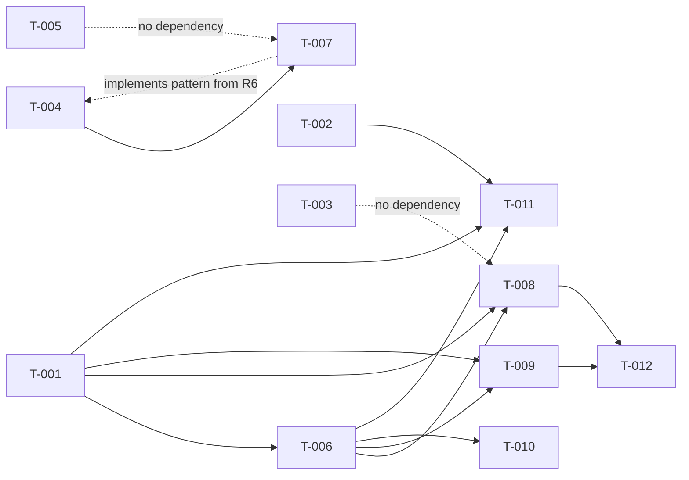

# Build Site: Core Types & Contracts

12 requirements across 4 tiers from **cavekit-core-types.md**. + 3 fix tasks (T-013..T-015) from inspection findings.

---

## Tier 0 — No Dependencies (Start Here)

| Task | Title | Cavekit | Requirement | Effort |
|------|-------|---------|-------------|--------|
| T-001 | Implement XRoadMemberIdentifier type | core-types | R1 | M |
| T-002 | Implement XRoadCentralServiceIdentifier type | core-types | R3 | M |
| T-003 | Implement BinaryContent attachment type | core-types | R5 | M |
| T-004 | Implement custom attributes for type provider | core-types | R6 | M |
| T-005 | Implement Optional<T> and Nullable<T> helpers | core-types | R8 | S |

---

## Tier 1 — Depends on Tier 0

| Task | Title | Cavekit | Requirement | blockedBy | Effort |
|------|-------|---------|-------------|-----------|--------|
| T-006 | Implement XRoadServiceIdentifier type | core-types | R2 | T-001 | M |
| T-007 | Implement Choice type helpers and interfaces | core-types | R7 | T-004 | M |

---

## Tier 2 — Depends on Tier 1

| Task | Title | Cavekit | Requirement | blockedBy | Effort |
|------|-------|---------|-------------|-----------|--------|
| T-008 | Implement SOAP XRoadHeader container | core-types | R4 | T-001, T-006 | M |
| T-009 | Implement AbstractEndpointDeclaration | core-types | R9 | T-001, T-006 | M |
| T-010 | Implement meta-service WSDL bootstrapping | core-types | R10 | T-001, T-006 | M |
| T-011 | Implement robust identifier parsing (Result-based) | core-types | R11 | T-001, T-002, T-006 | L |

---

## Tier 3 — Depends on Tier 2

| Task | Title | Cavekit | Requirement | blockedBy | Effort |
|------|-------|---------|-------------|-----------|--------|
| T-012 | Implement request context and tracing | core-types | R12 | T-008, T-009 | M |

---

## Tier 4 — Fix Tasks from Inspection (no new dependencies)

| Task | Title | Cavekit | Requirement | From Finding | Effort |
|------|-------|---------|-------------|-------------|--------|
| T-013 | Fix empty-field validation in Member/Service TryParse | core-types | R11 | F-003 | S |
| T-014 | Fix service identifier version regex (^v\d+$ not ^v{\d+}$) and add 5-part test | core-types | R11 | F-001, F-004 | S |
| T-015 | Remove duplicate ResponseReady trigger from MakeServiceCall | core-types | R12 | F-002 | S |
| T-016 | Remove duplicate RequestReady trigger from MakeServiceCall (line 290) | core-types | R12 | F-005 | S |
| T-017 | Add counter-based tests asserting RequestReady and ResponseReady fire exactly once per call | core-types | R12 | G-001 | S |
| T-018 | Add regression test exercising CreateMessage path to verify RequestReady fires once per MakeServiceCall flow | core-types | R12 | F-006 | M |

---

## Summary

| Tier | Tasks | Effort |
|------|-------|--------|
| 0 | 5 | 4M + 1S |
| 1 | 2 | 2M |
| 2 | 4 | 3M + 1L |
| 3 | 1 | 1M |
| 4 (fix) | 6 | 5S + 1M |

**Total: 18 tasks, 4 tiers + fixes**

---

## Coverage Matrix

| Cavekit | Req | Criterion | Task(s) | Status |
|---------|-----|-----------|---------|--------|
| core-types | R1 | XRoadMemberIdentifier has 4 properties (instance, class, code, subsystem) | T-001 | COVERED |
| core-types | R1 | SubsystemCode is optional | T-001 | COVERED |
| core-types | R1 | ToString() returns canonical string | T-001 | COVERED |
| core-types | R1 | Parse(string) reconstructs from canonical | T-001 | COVERED |
| core-types | R1 | Parse fails with clear error on invalid format | T-001 | COVERED |
| core-types | R1 | Equality comparison works correctly | T-001 | COVERED |
| core-types | R1 | ObjectId returns "MEMBER" or "SUBSYSTEM" | T-001 | COVERED |
| core-types | R2 | XRoadServiceIdentifier has Owner, ServiceCode, ServiceVersion | T-006 | COVERED |
| core-types | R2 | ServiceVersion is optional | T-006 | COVERED |
| core-types | R2 | ToString() returns canonical string | T-006 | COVERED |
| core-types | R2 | Owner refers to service provider | T-006 | COVERED |
| core-types | R2 | ServiceCode is required (non-empty) | T-006 | COVERED |
| core-types | R2 | Equality comparison works correctly | T-006 | COVERED |
| core-types | R2 | ObjectId returns "SERVICE" | T-006 | COVERED |
| core-types | R3 | XRoadCentralServiceIdentifier has XRoadInstance, ServiceCode | T-002 | COVERED |
| core-types | R3 | ToString() returns canonical string | T-002 | COVERED |
| core-types | R3 | Parse(string) reconstructs from canonical | T-002 | COVERED |
| core-types | R3 | Parse fails with clear error on invalid format | T-002 | COVERED |
| core-types | R3 | ObjectId returns "CENTRALSERVICE" | T-002 | COVERED |
| core-types | R4 | XRoadHeader has 4 properties (protocol, requestId, service, client) | T-008 | COVERED |
| core-types | R4 | Properties exposed for read and write | T-008 | COVERED |
| core-types | R4 | Default values sensible (UUID for requestId) | T-008 | COVERED |
| core-types | R4 | Can construct with specific values | T-008 | COVERED |
| core-types | R4 | ToString() provides readable representation | T-008 | COVERED |
| core-types | R5 | BinaryContent has ContentID property | T-003 | COVERED |
| core-types | R5 | Stream/array access to binary data | T-003 | COVERED |
| core-types | R5 | Can be created from byte array | T-003 | COVERED |
| core-types | R5 | Can be created from stream | T-003 | COVERED |
| core-types | R5 | Content stream properly disposed | T-003 | COVERED |
| core-types | R5 | ContentID defaults to UUID if not provided | T-003 | COVERED |
| core-types | R5 | Can be used in generated types for binary | T-003 | COVERED |
| core-types | R6 | [XRoadType(LayoutKind)] attribute for type composition | T-004 | COVERED |
| core-types | R6 | [XRoadElement] on properties with 5 params | T-004 | COVERED |
| core-types | R6 | [XRoadOperation] on service methods | T-004 | COVERED |
| core-types | R6 | [XRoadRequest] on request message wrappers | T-004 | COVERED |
| core-types | R6 | [XRoadResponse] on response message wrappers | T-004 | COVERED |
| core-types | R6 | [XRoadCollection] on repeated element properties | T-004 | COVERED |
| core-types | R6 | Attributes are read by serialization code | T-004 | COVERED |
| core-types | R6 | Default attribute values sensible | T-004 | COVERED |
| core-types | R7 | Choice type interface hierarchy (up to 8 cases) | T-007 | COVERED |
| core-types | R7 | Each union case is discriminated with optional data | T-007 | COVERED |
| core-types | R7 | Choice interface has method to extract value | T-007 | COVERED |
| core-types | R7 | Generated choice types implement correct interface | T-007 | COVERED |
| core-types | R7 | Generated choice types compile without null errors | T-007 | COVERED |
| core-types | R7 | Serialization identifies active union case | T-007 | COVERED |
| core-types | R8 | Nullable<T> used for value types | T-005 | COVERED |
| core-types | R8 | Option<T> used for reference types | T-005 | COVERED |
| core-types | R8 | Default values for optional props are None/null | T-005 | COVERED |
| core-types | R8 | Serialization handles None/null correctly | T-005 | COVERED |
| core-types | R8 | Deserialization creates Option/Nullable correctly | T-005 | COVERED |
| core-types | R8 | No unwanted null dereferences in generated code | T-005 | COVERED |
| core-types | R9 | AbstractEndpointDeclaration has Uri property | T-009 | COVERED |
| core-types | R9 | Has AuthenticationCertificates list | T-009 | COVERED |
| core-types | R9 | Has AcceptedServerCertificate for pinning | T-009 | COVERED |
| core-types | R9 | Has DefaultOffset for date/time context | T-009 | COVERED |
| core-types | R9 | HttpClientFactory property with getter/setter | T-009 | COVERED |
| core-types | R9 | ResponseReady event support | T-009 | COVERED |
| core-types | R9 | Event includes response metadata | T-009 | COVERED |
| core-types | R9 | Configuration accessible to serialization layers | T-009 | COVERED |
| core-types | R10 | MetaServices module has listMethods WSDL | T-010 | COVERED |
| core-types | R10 | MetaServices has producer/service list definitions | T-010 | COVERED |
| core-types | R10 | WSDL fetchable without WSDL URL param | T-010 | COVERED |
| core-types | R10 | Meta-service calls formatted for X-Road v6 | T-010 | COVERED |
| core-types | R11 | Parse methods use Result<T, Error> not exceptions | T-011 | COVERED |
| core-types | R11 | Error messages suggest format with examples | T-011 | COVERED |
| core-types | R11 | Partial parsing failures reported clearly | T-011 | COVERED |
| core-types | R11 | Whitespace handling correct | T-011 | COVERED |
| core-types | R11 | Case sensitivity correct (case-sensitive codes) | T-011 | COVERED |
| core-types | R12 | XRoadRequest has RequestId (UUID) | T-012 | COVERED |
| core-types | R12 | XRoadResponse includes request metadata | T-012 | COVERED |
| core-types | R12 | RequestId visible to ResponseReady subscribers | T-012 | COVERED |
| core-types | R12 | Service code/version in ResponseReady event | T-012 | COVERED |
| core-types | R12 | Enables correlation for async scenarios | T-012 | COVERED |
| core-types | R12 | ResponseReady fires exactly once per call | T-015 | COVERED |
| core-types | R12 | RequestReady fires exactly once per call | T-016 | OPEN |
| core-types | R11 | Required fields validated non-empty | T-013 | COVERED |
| core-types | R11 | Version regex correct (^v\d+$) | T-014 | COVERED |
| core-types | R11 | 5-part service identifier parsed correctly | T-014 | COVERED |

**Coverage: 85/86 criteria (98.8%)**

---

## Dependency Graph

---

## Architect Report

### Kits Read: 1
- **cavekit-core-types.md** — Core Types & Contracts (12 requirements)

### Tasks Generated: 12
All acceptance criteria from 12 requirements mapped to discrete, parallelizable tasks.

### Tiers: 4
- **Tier 0:** 5 independent tasks (R1, R3, R5, R6, R8)
- **Tier 1:** 2 tasks depending on R1 and R6 (R2, R7)
- **Tier 2:** 4 tasks depending on R1, R2, R6 (R4, R9, R10, R11)
- **Tier 3:** 1 task depending on R4, R9 (R12)

### Tier 0 Tasks: 5
Can run in parallel immediately:
- T-001: XRoadMemberIdentifier (M)
- T-002: XRoadCentralServiceIdentifier (M)
- T-003: BinaryContent (M)
- T-004: Custom Attributes (M)
- T-005: Optional/Nullable Helpers (S)

### Critical Path
T-001 → T-006 → T-008 → T-012 (or T-009 → T-012) = 4 hops, ~5-6 hours

### Key Notes
1. **Immutability caveat (R4):** XRoadHeader is mutable by design (properties with get/set). This is noted as a GAP in the cavekit but is necessary for practical use. Task T-008 will document this trade-off.
2. **Result-based parsing (R11):** Refactoring Parse methods from exception-based to Result-based is a significant effort (L). This may touch R1, R2, R3 implementations retrospectively.
3. **Resource leak (R10):** BinaryContent and meta-service streams need careful disposal. Tasks T-003 and T-010 include explicit disposal verification.
4. **Choice type limitation:** R7 is capped at 8 union cases. This is a hard constraint noted in the cavekit.

### Next Step
Run implementation to begin with Tier 0 (5 parallel tasks).
